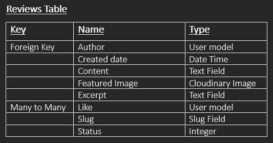

# *Kurly~Cake~Kreations*

*Kurly Cake Kreations*, is a maker of beautiful cakes, that takes online orders and delivers across the UK.

Users of the site are able to create an account, browse a gallery of available cakes, search according to ingredients, flavours and diet choice, and choose dates for collection or delivery.

*Kurly~Cake~Kreations* welcomes feedback and reviews from their customers on a dedicated page.
___
___

## Table of Contents

- [Features](#features)
- [Project Planning & Development](#project-planning--development)
- [Prerequisites](#prerequisites)
- [Dependencies and Required Packages](#dependencies-and-required-packages)
- [Installation](#installation)
- [Use](#use)
- [Testing of Functions](#testing-of-functions)
- [Further Development](#further-development)
- [Copy / Improve / Constribute](#copy--improve--constribute)
- [Credits, Acknowledgments and Appreciation-to](#credits-acknowledgments-and-appreciation-to)

___

## Features

___

## Project Planning & Development

### Apps required in project

Table for planning "Reviews" database models

- Cakes
- Orders
- Reviews

___

## Prerequisites

- Python 3.*

___

## Dependencies and Required Packages

- asgiref
- click
- cloudinary
- dj-database-url
- dj3-cloudinary-storage
- Django
- gunicorn
- pathspec
- psycopg2
- sqlparse
- urllib3

___

## Development & Code Quality Tools

- black
- pylint
- pylint-django
- pylint-plugin-utils

___
___

## Installation

If you don't have python installed on your machine, you can download it and
install it from the [official website](https://www.python.org/downloads/)

### Using the terminal, enter the commands as follows

Install Django and Gunicorn and their supporting libraries. Django 3.2 was chosen as it was the LTS (Long Term Support) version of Django.

- "**pip3 install 'django<4' gunicorn**"

- "**pip3 install dj_database_url==0.5.0 psycopg2**" to install the supporting libraries.

- "**pip3 install dj3-cloudinary-storage**" and
- "**pip3 install urllib3==1.26.15**" to install the Cloudinary libraries.

- "**pip3 freeze --local > requirements.txt**". This will create a new file called "reqiuirements.txt", if there isn't one already and then list the packages that are installed locally.

Creating the projet:

- "**django-admin startproject PROJ_NAME .**" Not forgetting the "**.**" (full stop), otherwise the directory structure will be nested when created. Where "PROJ_NAME" is, "*Kurly-Cake-Kreations*" was entered.

Creating the "reviews" page which is part of the site:

- "**python3 manage.py startapp APP_NAME**" Where "APP_NAME" is, "*reviews*" was entered.

### Edit the "settings.py"

In the file settings.py, find the section that says:
INSTALLED_APPS and add the name of the app (in this case "reviews"), with the square brackets, not forgetting the use of a coma to diffenciate between apps.

### Migrate these changes with

- "**python3 manage.py migrate**"

### Run the server to test with

- "**python3 manage.py runserver**"  Initially you'll receive an error because jango doesn't automatically recognise the hostname - the server name the app is running on. Discounting the "http://", from the search bar, copy the hostname, open the settings.py and find the secion "ALLOWED_HOSTS = []" and paste in the hostname, including the quotes, so it will look something like this: "**ALLOWED_HOSTS = ['8000-nielmc-django-project-0kylrta3cs.us2.codeanyapp.com']**"

___

## Use

### User sign-in

___
___

## Testing of functions

## Conclusion

___

## Further Development

___

## Deployment

___

## Copy / Improve / Constribute

If anyone wishes to copy and improve this software by contributing changes,
please do.  You will find instructions from
[GitHub on how to do this.]
___

## Credits, Acknowledgments and Appreciation to
